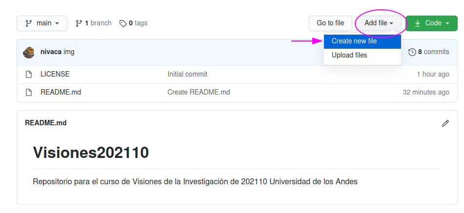
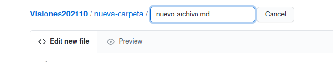
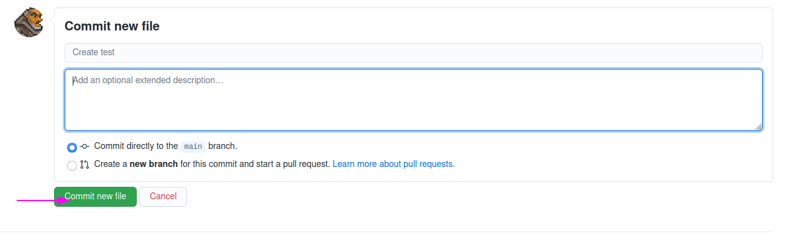

# Cómo crear un folder nuevo en Github usando solo la interfaz web

- La interfaz web de Github *no* permite crear folders vacíos. Para crear un folder nuevo, deben crear un folder *y* un archivo nuevo.
- Para crearlo, hagan click en el botón `Add file` y luego en `Create new file`:

- Luego escriban primero el nombre del nuevo folder (e.g. `nueva-carpeta`) seguido de una barra (`/`) y finalmente el nombre del archivo nuevo (`nuevo-archivo.md`):
.
- Finalmente presionen el botón `Commit` ("enviar") para que el archivo y la carpeta queden creados:
.

# Nombres de archivo y de carpeta
- No se pueden dejar espacios en blanco en los nombres de archivos y carpeta.
- Usen guiones (`-`) o guiones bajos (`_`) para separar las palabra sen ellos: `mi-nueva-carpeta`.
