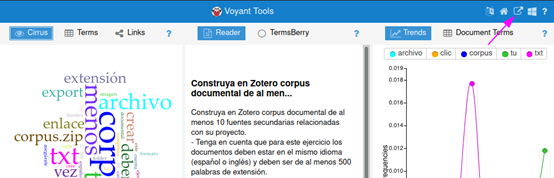
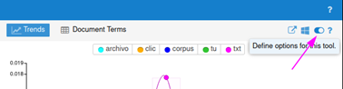

# Ejercicio con Voyant Tools sobre un corpus de textos

1. Construya en Zotero un corpus documental de al menos diez (10) fuentes secundarias relacionadas con su proyecto. Tenga en cuenta que para este ejercicio los documentos deben estar en el mismo idioma (español o inglés) y deben ser de al menos 500 palabras de extensión.

2. En su carpeta personal en el [repositorio GitHub del módulo](https://github.com/nivaca/Visiones202110), cree un fólder llamado `Corpus`.

3. Extraiga el texto de cada fuente (puede seleccionarlo todo y pegarlo, o si su editor/visor de PDF lo permite, puede guardarla como texto plano) y guárdelo en un archivo de texto plano con la extensión `.txt`.

4. Nombre cada documento en secuencia: `01.txt`, `02.txt`, ..., `10.txt`. 

5. Comprima en formato ZIP el fólder (el archivo resultando se llamará `Corpus.zip`).

6. Entre a https://voyant-tools.org, haga clic en `Upload` y suba el archivo `Corpus.zip.`

7. Hecho eso, cree un enlace permanente para su corpus. Haga clic en el ícono de `Export URL`:

y haga click en `Export`. Su corpus seguirá siendo accesible mientras lo abra por lo menos una vez al mes. Asegúrese de crear un marcador (*bookmark*) en su navegador para guardar el enlace de su corpus.

8. Los resultados iniciales seguramente no se verán muy interesantes. Dirá que las palabras más comunes son "más", "que", o "a" si está trabajando con documentos en español (o "a", "the" y "and" si está trabajando con documentos en inglés). Necesitamos filtrar estas palabras creando unas *stopwords* que serán excluidas del análisis. Haga clic en el botón `Define options for this tool`:

y al lado del campo `Stopword-Auto-detect`; haga clic en `Edit list`. Añada las palabras necesarias, guarde y dele click a `Confirm`. El corpus se podrá visualizar bien ahora.
