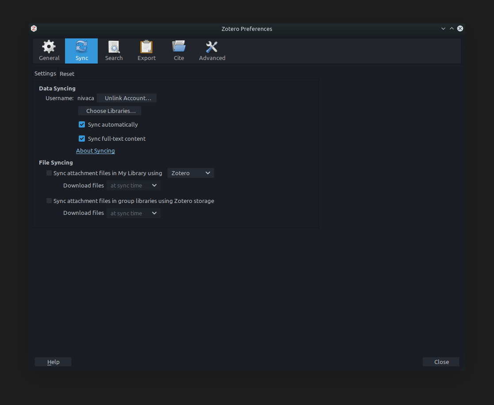
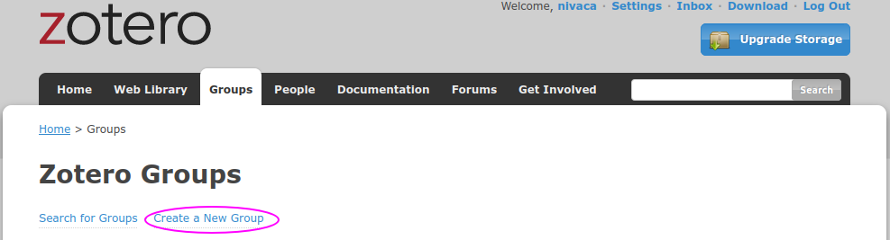
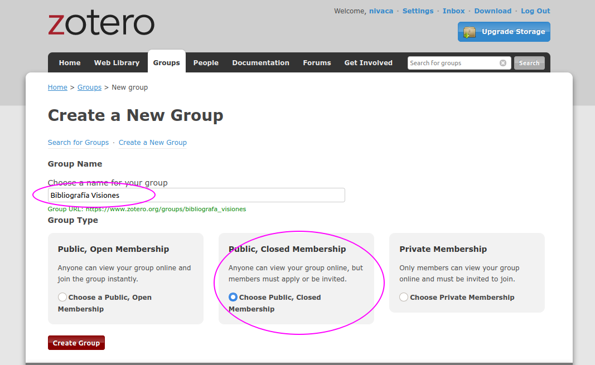
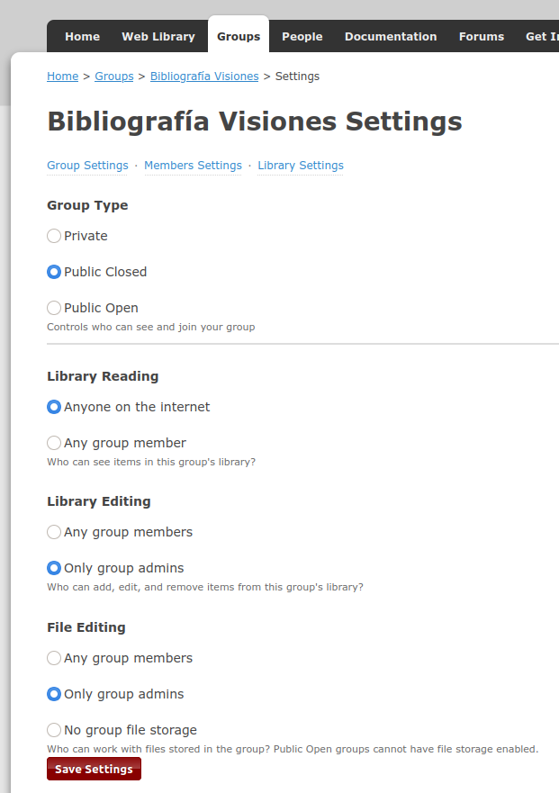
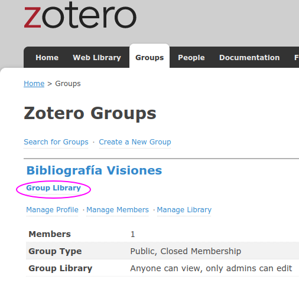
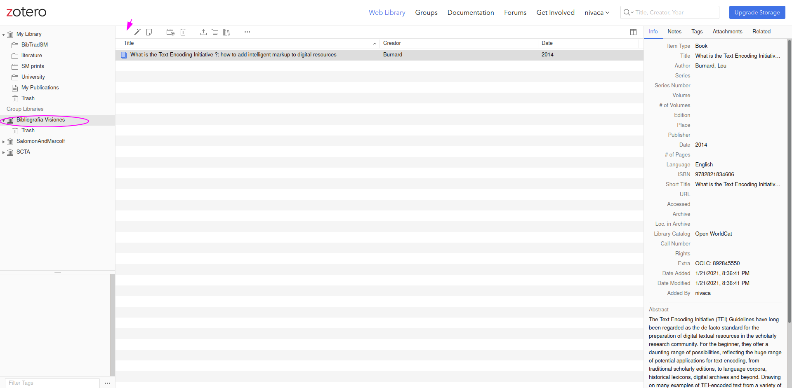

# Cómo usar Zotero para crear y administrar la bibliografía del proyecto de tesis

## Aplicación web de Zotero

1. Si no tienen una cuenta gratuita en Zotero aún, créenla aquí: https://www.zotero.org/user/register
2. Inicien sesión con su cuenta nueva de Zotero. Vayan ahora a su biblioteca (`Library`).
3. Desde esa aplicación web podrán administrar toda su biblioteca.

## Aplicación para computador de Zotero
1. Si lo desean, también pueden usar la aplicación de Zotero en su computador. Descárguenla aquí: https://www.zotero.org/download/ Seleccionen la opción según el sistema operativo que estén usando (Windows, MacOS o Linux).
2. Una vez instalado, vayan a las Preferencias y luego vayan a la pestaña de Sync:



3. Ahí deberán poner los datos de su cuenta personal de Zotero. Asegúrense de que tengan las mismas opciones seleccionadas que en la imagen.


## Creación de la bibliografía compartida
1. Cada estudiante debe crear una bibliografía para su proyecto. Debe ser compartida (para que otros la puedan mirar, pero no cambiar).
2. Usando la aplicación web, vayan a `Groups` y hagan click en `Create a New Group`:



3. Denle el siguiente nombre al grupo: `Bibliografía Visiones` y seleccionen la segunda opción, `Public, Closed Membership`:



4. Ahora configuren el grupo así:



5. Hagan click en `Save Settings`. 

6. Ahora necesitamos saber cuál es el enlace público del grupo. De nuevo en `Groups` hagan click en `Group Library`:



7. Ese es el enlace del grupo. Cópienlo y péguenlo en una sección del documento `proyecto.md` titulada `Bibliografía`,  así:

```
... 
# Bibliografía
El enlace de la bibliografía es este: https://www.zotero.org/groups/2726220/bibliografa_visiones/library
```

8. Asegúrense de que otras personas también tengan acceso a ese enlace (p. ej. ábranlo en otro navegador o en una ventana incógnita)

9. Ya pueden empezar a trabajar en la bibliografía:



10. Asegúrense asimismo de que las entradas bibliográficas nuevas queden guardadas en el grupo compartido.


## Otros recursos
- https://www.zotero.org/support/es/start (en español)
- https://www.zotero.org/support/start
- [Zotero Groups](https://research.library.gsu.edu/zotero/groups)
- [Learn how to use Zotero in 30 minutes](https://www.youtube.com/watch?v=BQL_7C-YqBk)
